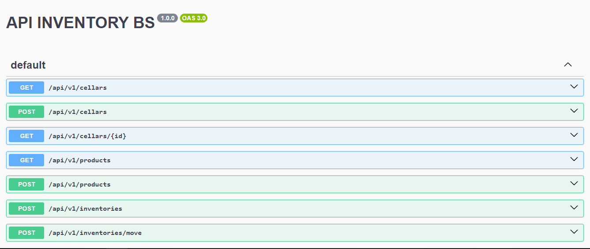

# Inventario BS - Sistema de Inventario Sencillo



¡Bienvenido al repositorio de Inventario BS! En este repositorio encontrarás un sistema de inventario sencillo pero funcional.

## Descripción

Este proyecto tiene como objetivo proporcionar una solución de inventario fácil de usar. Puedes acceder a la [Documentación de la REST API](https://inventory-bs-rest.onrender.com/api/v1/doc/) para obtener más detalles. También puedes encontrar información en el archivo `app.http`.

## Tecnologías Utilizadas

-   Node.js con Express
-   Sequelize con PostgreSQL
-   Docker

## Cómo Empezar

1. Clona el proyecto usando el siguiente comando:

    ```
    git clone https://github.com/bsquiroz/inventory_bs_rest.git
    ```

2. Instala las dependencias. Asegúrate de estar dentro del directorio del proyecto y ejecuta:

    ```
    npm install
    ```

3. Opcional pero recomendado: Si tienes Docker instalado, puedes ejecutar el siguiente comando para tener PostgreSQL y Pgstore en ejecución:

    ```
    docker-compose up -d
    ```

4. Si no usas Docker, asegúrate de modificar el archivo `.env` en la raíz del proyecto con tus propias credenciales de PostgreSQL:

    ```
    DB_DIALECT=postgres
    DB_HOST=localhost
    DB_PORT=5432
    DB_USERNAME=TU USUARIO DE POSTGRES
    DB_PASSWORD=TU CONTRASEÑA DE POSTGRES
    DB_DATABASE=NOMBRE DE TU BASE DE DATOS
    ```

5. Para iniciar el proyecto, ejecuta:

    ```
    npm run start
    ```

Con estos pasos, tendrás el backend en funcionamiento en tu máquina.
